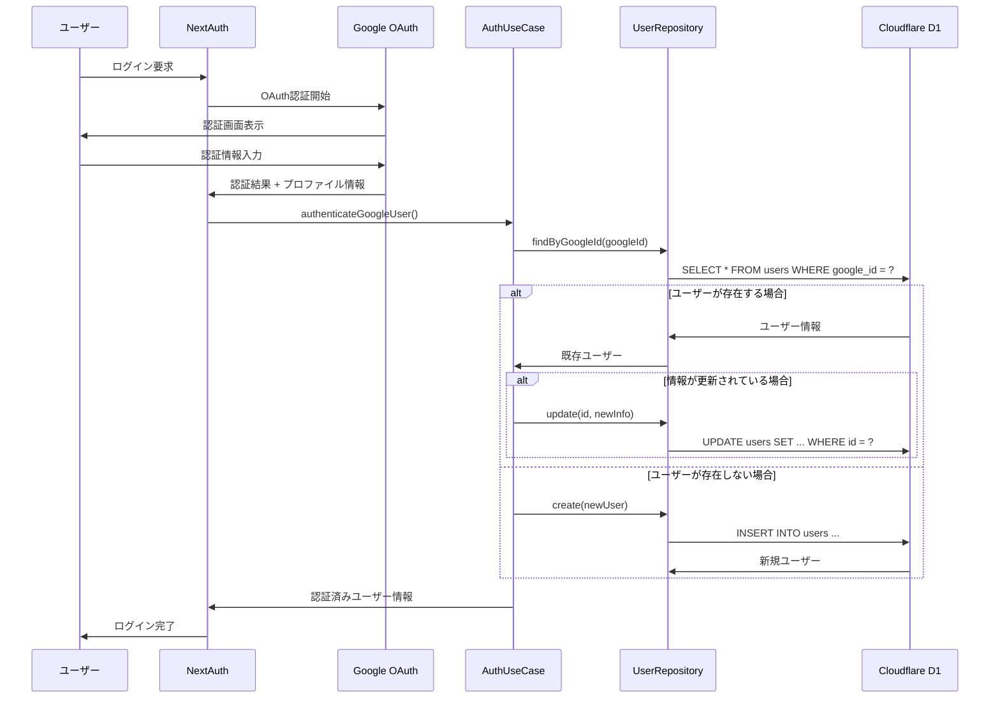

# 認証フロー詳細

## 概要

本システムでは、Google OAuthを使用した認証時に、自動的にユーザー情報をデータベースで照合・作成・更新する仕組みを実装しています。

## 認証フロー図



## 処理ステップ詳細

### 1. NextAuth設定 (`src/auth.ts`)

```typescript
export const { handlers, signIn, signOut, auth } = NextAuth({
  trustHost: true,
  providers: [Google],
  callbacks: {
    async signIn({ user, account, profile }) {
      // Google認証時の処理
    },
    async jwt({ token, user }) {
      // JWTトークン作成時の処理
    },
    async session({ session, token }) {
      // セッション作成時の処理
    },
  },
});
```

### 2. signInコールバック処理

#### 2.1 プロファイル検証
```typescript
if (account?.provider === "google" && profile) {
  if (!profile.sub || !profile.email || !profile.name) {
    console.error("Missing required profile information");
    return false;
  }
}
```

#### 2.2 データベース接続
```typescript
const { env } = getCloudflareContext();
if (!env.HOME_APP2_DB) {
  console.error("Database not configured");
  return false;
}

const db = getDb(env.HOME_APP2_DB);
```

#### 2.3 依存関係の解決
```typescript
const userRepository = new UserRepositoryImpl(db);
const authUseCase = new AuthUseCase(userRepository);
```

#### 2.4 ユーザー認証処理
```typescript
const authenticatedUser = await authUseCase.authenticateGoogleUser({
  googleId: profile.sub,
  email: profile.email,
  name: profile.name,
});
```

### 3. AuthUseCase処理 (`src/usecases/auth_usecase.ts`)

#### 3.1 既存ユーザー検索
```typescript
let user = await this.userRepository.findByGoogleId(profile.googleId);
```

#### 3.2 既存ユーザーの場合の更新処理
```typescript
if (user) {
  // 情報が変更されている場合は更新
  if (user.email !== profile.email || user.name !== profile.name) {
    const updatedUser = await this.userRepository.update(user.id, {
      email: profile.email,
      name: profile.name,
    });
    return updatedUser || user;
  }
  return user;
}
```

#### 3.3 新規ユーザーの場合の作成処理
```typescript
const createUserRequest: CreateUserRequest = {
  googleId: profile.googleId,
  email: profile.email,
  name: profile.name,
};

return await this.userRepository.create(createUserRequest);
```

### 4. UserRepository実装 (`src/infrastructure/repositories/user_repository_impl.ts`)

#### 4.1 Google IDによる検索
```typescript
async findByGoogleId(googleId: string): Promise<User | null> {
  const result = await this.db.select()
    .from(users)
    .where(eq(users.googleId, googleId))
    .limit(1);
  return result[0] || null;
}
```

#### 4.2 ユーザー作成
```typescript
async create(userRequest: CreateUserRequest): Promise<User> {
  const now = new Date();
  const result = await this.db
    .insert(users)
    .values({
      googleId: userRequest.googleId,
      email: userRequest.email,
      name: userRequest.name,
      createdAt: now,
      updatedAt: now,
    })
    .returning();

  return result[0];
}
```

#### 4.3 ユーザー更新
```typescript
async update(id: number, userRequest: UpdateUserRequest): Promise<User | null> {
  const now = new Date();
  const result = await this.db
    .update(users)
    .set({
      ...userRequest,
      updatedAt: now,
    })
    .where(eq(users.id, id))
    .returning();

  return result[0] || null;
}
```

### 5. JWTコールバック処理

```typescript
async jwt({ token, user }) {
  if (user) {
    token.googleId = user.googleId;
  }
  return token;
}
```

### 6. セッションコールバック処理

```typescript
async session({ session, token }) {
  if (token.googleId && token.sub) {
    session.user.id = token.sub;
    session.user.googleId = token.googleId as string;
  }
  return session;
}
```

## エラーハンドリング

### 認証エラーの場合
```typescript
catch (error) {
  console.error("Authentication error:", error);
  return false; // ログイン失敗
}
```

### データベースエラーの場合
- 接続エラー: `DATABASE_CONNECTION_ERROR`
- 制約違反: `CONSTRAINT_VIOLATION_ERROR`
- 一般的なエラー: `INTERNAL_SERVER_ERROR`

## セキュリティ考慮事項

1. **Google IDの一意性**: `google_id`フィールドにユニーク制約を設定
2. **メールアドレスの一意性**: `email`フィールドにユニーク制約を設定
3. **プロファイル情報の検証**: 必須フィールドの存在確認
4. **エラー情報の制限**: 本番環境では詳細エラー情報を非表示

## 型定義

### User Entity
```typescript
interface User {
  id: number;
  googleId: string;
  email: string;
  name: string;
  createdAt: Date;
  updatedAt: Date;
}
```

### NextAuth拡張型
```typescript
declare module "next-auth" {
  interface Session {
    user: {
      id: string;
      googleId: string;
    } & DefaultSession["user"];
  }

  interface User {
    googleId: string;
  }
}
```